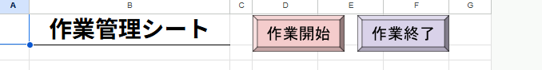
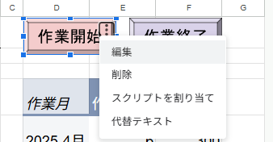
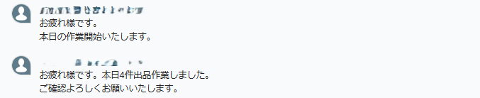

# GAS - Chatwork 作業報告自動化

## 概要

Google スプレッドシートと Chatwork を連携し、

- 作業開始の通知
- 当日の作業件数を集計して終了報告  
  
を自動化する Google Apps Script プロジェクトです。
業務における「毎日の作業開始・終了報告」を効率化し、入力漏れや手間を削減できます。

---

## 機能

- 作業開始通知
  Chatwork に「本日の作業を開始します」と送信
- 作業終了通知
  管理シートに入力された当日の作業件数を集計し、Chatwork に報告

---

## 使用技術

- Google Apps Script (GAS)
- Google Spreadsheet
- Chatwork API

---

## 実行方法

1. スプレッドシートの A 列に日付を入力する
2. Google Apps Script エディタにコードを貼り付ける
3. スクリプトプロパティに以下を設定する
   - `CHATWORK_API` : Chatwork API トークン
   - `CHATWORK_ROOM_ID` : 通知先のルーム ID
4. `notifyStart()` または `notifyEnd()` を手動で実行、もしくはスプレッドシートにボタンを作成してスクリプト割り当てを行う
   
   

---

## サンプルスクリーンショット

---

## 学んだこと / 工夫点

- Chatwork API を用いた外部サービスとの連携
- GAS での日付処理・件数集計ロジック
- UI を利用したユーザへの通知（アラート表示）
- エラーハンドリングの実装（API トークン・ルーム ID 不備の検出）
